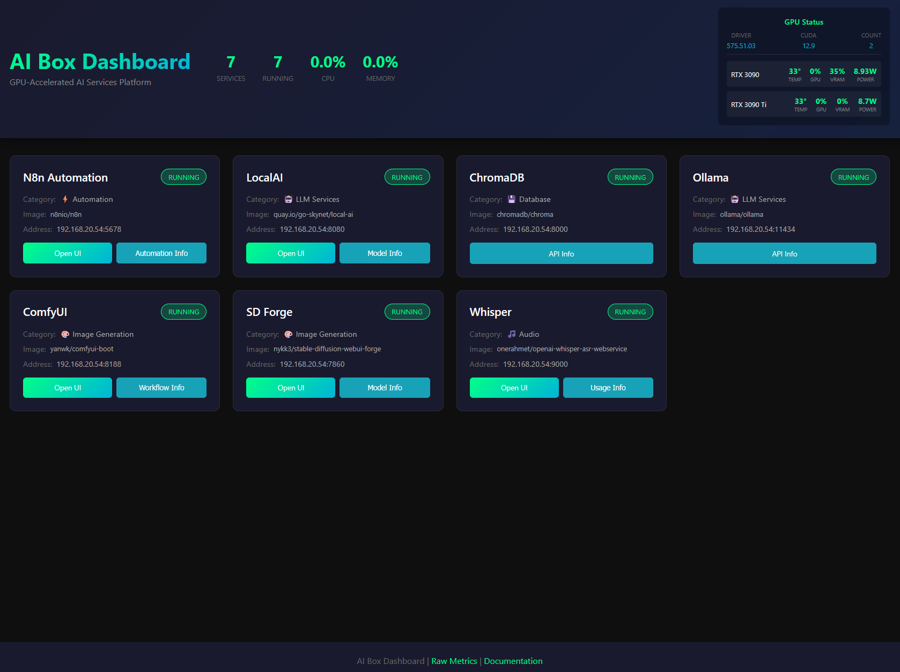

# 🤖 AI Box - Complete GPU-Accelerated AI Services Platform



A production-ready platform for deploying and managing GPU-accelerated AI services with a unified web dashboard. Deploy multiple AI services (LLMs, image generation, vector databases, workflow automation) with a single command on any NVIDIA GPU-equipped Linux system.

## ✨ Key Features

- **🚀 One-Command Deployment**: Automated setup with GPU driver installation
- **🎮 Modern Web Dashboard**: Real-time monitoring with GPU metrics
- **🔧 Containerized Architecture**: Docker-based services with proper isolation
- **📊 Live GPU Monitoring**: Real-time temperature, utilization, and VRAM usage
- **🌐 Network-Agnostic**: Works on any network with dynamic IP configuration
- **🔒 Security-First**: Input validation, proper error handling, and service isolation

## 🛠️ Included Services

### 🤖 Language Models (LLMs)
- **LocalAI** `8080` - OpenAI-compatible API for local LLMs with CUDA acceleration
- **Ollama** `11434` - Easy model management with extensive model library

### 🎨 Image Generation  
- **Stable Diffusion Forge** `7860` - Optimized WebUI with FLUX and advanced features
- **ComfyUI** `8188` - Node-based workflow system for advanced image generation

### 🗄️ Infrastructure & Automation
- **ChromaDB** `8000` - Vector database for RAG applications and embeddings
- **n8n** `5678` - Workflow automation and AI chain orchestration  
- **Whisper** `9000` - OpenAI Whisper speech-to-text transcription

### 📊 Monitoring
- **AI Box Dashboard** `8085` - Unified control panel with GPU monitoring
- **GPU Metrics Server** `9999` - Real-time NVIDIA GPU telemetry

## 💻 System Requirements

### ✅ Minimum Requirements
- **OS**: Ubuntu 20.04+ or compatible Linux distribution
- **GPU**: NVIDIA GPU with 8GB+ VRAM
- **RAM**: 16GB system memory
- **Storage**: 100GB free space
- **Docker**: Will be installed automatically if not present

### 🚀 Recommended Configuration
- **OS**: Ubuntu 22.04 LTS  
- **GPU**: NVIDIA RTX 3090/4090 or better (RTX 4000 series preferred)
- **RAM**: 32GB+ system memory
- **Storage**: 500GB+ NVMe SSD
- **Network**: Stable internet connection for model downloads

## 🚀 Quick Start

```bash
# Clone the repository
git clone https://github.com/ben-spanswick/AI-Deployment-Automation.git
cd AI-Deployment-Automation

# Run the automated installer (requires sudo)
sudo ./setup.sh

# Follow interactive prompts to select services
# The installer will:
# - Install NVIDIA drivers (latest stable)
# - Set up Docker with NVIDIA Container Toolkit  
# - Deploy selected AI services
# - Configure the dashboard
```

**After installation, access your AI Box at:** `http://0.0.0.0:8085`

## 🎯 Service Access Points

| Service | URL | Purpose |
|---------|-----|---------|
| **AI Box Dashboard** | `http://0.0.0.0:8085` | Main control panel |
| **LocalAI** | `http://0.0.0.0:8080` | LLM API (OpenAI compatible) |
| **Ollama** | `http://0.0.0.0:11434` | Model management ([API info](http://0.0.0.0:8085/ollama-info)) |
| **SD Forge** | `http://0.0.0.0:7860` | Image generation WebUI |
| **ComfyUI** | `http://0.0.0.0:8188` | Advanced image workflows |
| **ChromaDB** | `http://0.0.0.0:8000` | Vector database ([API info](http://0.0.0.0:8085/chromadb-info)) |
| **n8n** | `http://0.0.0.0:5678` | Workflow automation |
| **Whisper** | `http://0.0.0.0:9000` | Speech-to-text API |

## 📊 Dashboard Features

The modern AI Box Dashboard provides:

- **Real-time GPU monitoring** - Temperature, utilization, VRAM usage, power draw
- **Service management** - Start/stop/restart services with one click
- **Live metrics** - CPU and memory usage per service
- **API documentation** - Built-in guides for ChromaDB and Ollama APIs
- **System information** - CUDA version, driver info, hardware details
- **Network-agnostic** - Works on any IP address/network configuration

## ⚙️ Configuration

### 🔧 Main Configuration
Edit `config/deployment.conf` to customize:
```bash
# Installation paths
AI_BOX_HOME="/opt/ai-box"
MODELS_DIR="/opt/ai-box/models"

# Port assignments  
DASHBOARD_PORT=8085
LOCALAI_PORT=8080

# GPU allocation
LOCALAI_GPUS="0,1"
FORGE_GPUS="0,1"
```

### 🐳 Docker Management
```bash
# View all services
docker ps

# Check specific service logs
docker logs localai
docker logs forge

# Restart a service  
docker restart ollama

# View GPU usage
nvidia-smi
```

## 🛡️ Security Features

- **Command injection protection** - Safe subprocess execution
- **Input validation** - Proper parsing of user inputs
- **Service isolation** - Each service runs in its own container
- **Network segmentation** - Services communicate through ai-network
- **API authentication** - Configurable access controls per service

## 🔧 Advanced Usage

### 🎛️ GPU Management
```bash
# Monitor GPU usage
watch nvidia-smi

# Check GPU server metrics
curl http://localhost:9999/gpu-metrics

# Allocate specific GPUs to services
export LOCALAI_GPUS="0"
export FORGE_GPUS="1"
docker-compose up -d
```

### 📦 Model Management
```bash
# Download models for Ollama
docker exec ollama ollama pull llama3.1:8b

# Add models to Stable Diffusion Forge
cp your-model.safetensors /opt/ai-box/models/stable-diffusion/

# LocalAI models go in
/opt/ai-box/models/localai/
```

## 🔍 Troubleshooting

### 🚫 Common Issues

**GPU not detected:**
```bash
# Check NVIDIA drivers
nvidia-smi

# Verify container toolkit
docker run --rm --gpus all nvidia/cuda:12.6-base-ubuntu22.04 nvidia-smi
```

**Dashboard not accessible:**
```bash  
# Check dashboard status
docker ps | grep dashboard

# View dashboard logs
docker logs dashboard

# Restart dashboard
docker restart dashboard
```

**Service won't start:**
```bash
# Check service status
docker ps -a

# View logs for specific service
docker logs [service-name]

# Check GPU availability
nvidia-smi
```

### 📋 Diagnostic Commands
```bash
# System health check
./scripts/check-status.sh

# GPU diagnostics  
./scripts/gpu-detect.sh

# Container diagnostics
docker system df
docker system prune  # Clean up if needed
```

## 🏗️ Technical Architecture

### 🐳 Container Stack
```
┌─────────────────────────────────────┐
│          AI Box Dashboard           │ Port 8085
│    (Management UI + GPU Monitor)    │
├─────────────────────────────────────┤
│  LocalAI  │  Ollama  │  SD Forge   │ Ports 8080, 11434, 7860
├─────────────────────────────────────┤  
│ ComfyUI   │ ChromaDB │    n8n      │ Ports 8188, 8000, 5678
├─────────────────────────────────────┤
│      Whisper      │ GPU Monitor    │ Ports 9000, 9999
└─────────────────────────────────────┘
            Docker ai-network
         NVIDIA Container Toolkit
              CUDA 12.6+
```

### 🔗 Network Architecture
- **ai-network**: Internal Docker bridge network for service communication
- **Host networking**: Dashboard and GPU server for external access
- **Dynamic IPs**: No hardcoded addresses - works on any network

### 💾 Data Management
```
/opt/ai-box/
├── models/           # Shared model storage
│   ├── stable-diffusion/
│   ├── localai/
│   └── ollama/
├── data/            # Service data
└── config/          # Configuration files
```

## 🤝 Contributing

We welcome contributions! The codebase follows modern practices:

- **Security-first development** - All inputs validated
- **Performance optimization** - Efficient API design and caching
- **Maintainable code** - Clear separation of concerns
- **Production-ready** - Proper error handling and logging

See [technical documentation](docs/technical-details.md) for detailed information.

## 📄 License

MIT License - see [LICENSE](LICENSE) file for details.

## 🙏 Acknowledgments

- **NVIDIA** - GPU acceleration and CUDA toolkit
- **Docker** - Containerization platform  
- **Open Source AI Community** - All the amazing projects integrated

---

**🔗 Quick Links:**
- 📖 [Detailed Documentation](docs/technical-details.md)
- 🐛 [Issue Tracker](https://github.com/ben-spanswick/AI-Deployment-Automation/issues)  
- 💬 [Discussions](https://github.com/ben-spanswick/AI-Deployment-Automation/discussions)

**⚡ Ready to deploy AI services in minutes? Run `sudo ./setup.sh` and get started!**