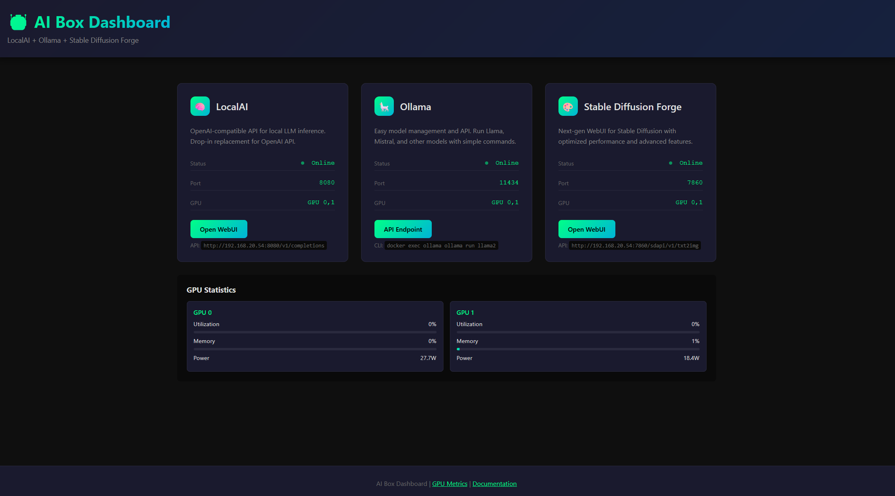

# 🤖 AI Box - Modern Multi-GPU AI Stack

> Flexible deployment of LocalAI, Ollama, and Stable Diffusion Forge with dynamic GPU configuration. Run OpenAI-compatible APIs locally with any number of NVIDIA GPUs.



[](https://ubuntu.com/)
[](https://www.nvidia.com/)
[](https://www.docker.com/)
[](https://github.com/go-skynet/LocalAI)
[](https://ollama.ai/)

## 🎯 Features

- **Modern AI Stack**:
  - **LocalAI**: OpenAI-compatible API for local LLM inference
  - **Ollama**: Easy model management with simple CLI/API
  - **Stable Diffusion Forge**: Next-gen WebUI with optimized performance
  - **NVIDIA DCGM**: GPU monitoring and metrics
  - **Web Dashboard**: Unified interface with service status and GPU metrics

- **Dynamic GPU Configuration**:
  - Automatically detects all NVIDIA GPUs
  - Flexible GPU assignment strategies
  - Support for 1 to unlimited GPUs
  - Per-service GPU allocation

- **Smart Deployment**:
  - Idempotent setup script (safe to re-run)
  - Preserves existing data and services
  - No automatic reboots (prompts when needed)
  - Automatic directory structure creation

## 📋 Requirements

- **OS**: Ubuntu 20.04, 22.04, or 24.04 (headless or desktop)
- **GPU**: NVIDIA GPU(s) - RTX 3090, 4090, A100, etc.
- **RAM**: 32GB+ recommended (16GB minimum)
- **Storage**: 500GB+ for models
- **Docker**: Version 24.0+ (automatically installed)
- **NVIDIA Driver**: 535+ (automatically installed)

## 🚀 Quick Start

### 1. Clone the Repository

```bash
git clone http://192.168.100.54:3000/Mandrake/AI-Deployment.git
cd AI-Deployment
```

### 2. Make Setup Executable

```bash
chmod +x setup.sh
```

### 3. Run Interactive Setup

```bash
./setup.sh
```

The setup will:
- ✅ Detect your GPU configuration
- ✅ Check for existing installations
- ✅ Create directory structure
- ✅ Deploy all services
- ✅ Configure the web dashboard

### 4. Access Your Services

After deployment:
- **Web Dashboard**: `http://your-server-ip/` (port 80)
- **LocalAI API**: `http://your-server-ip:8080`
- **Ollama API**: `http://your-server-ip:11434`
- **Stable Diffusion Forge**: `http://your-server-ip:7860`
- **GPU Metrics**: `http://your-server-ip:9400/metrics`

## 🎯 Web Dashboard

The deployment includes a modern web dashboard accessible on port 80:

### Features:
- **Service Status**: Real-time status indicators for all services
- **GPU Monitoring**: Live GPU utilization and memory usage
- **Quick Access**: Direct links to all service interfaces
- **Dynamic Detection**: Automatically detects server IP when accessed remotely

### Accessing from Another Computer:
Simply navigate to `http://your-server-ip/` in a web browser. The dashboard automatically adjusts URLs based on where you're accessing it from.

## 🎮 GPU Assignment Options

During setup, you'll be asked how to assign GPUs:

### 1. All GPUs Mode (Recommended for LLMs)
```
LocalAI: GPU 0,1,2,3
Ollama: GPU 0,1,2,3
Forge: GPU 0,1,2,3
```

### 2. Automatic Distribution
```
2 GPUs:
  LocalAI: GPU 0
  Ollama: GPU 1
  Forge: GPU 0,1
```

### 3. Manual Assignment
Specify exactly which GPUs each service uses

### 4. Single GPU Mode
All services share one GPU (for testing or limited hardware)

## 🛠️ Re-running the Setup

The setup script is designed to be safely re-run multiple times:

### If Services Are Already Running:
```
Found running services: localai ollama forge dcgm-exporter

What would you like to do with existing services?
1) Keep them running (recommended)
2) Restart with new configuration only
3) Stop services but keep data
4) Remove everything and redeploy (WARNING: data loss)
```

### Safe Defaults:
- **Never removes data** without explicit confirmation
- **Preserves existing services** by default
- **Skips completed installation steps**
- **No automatic reboots** - prompts when needed

## 📊 Service Management

### Check Service Status

```bash
docker ps
# Or use the dashboard at http://your-server-ip/
```

### View Logs

```bash
# All services
cd /opt/ai-box && docker compose logs -f

# Specific service
docker logs localai
docker logs ollama
docker logs forge
```

### Restart Services

```bash
# Individual service
docker restart localai

# All services
cd /opt/ai-box && docker compose restart
```

### Update Services

```bash
cd /opt/ai-box
docker compose pull
docker compose up -d
```

## 🔧 Model Management

### LocalAI Models
Place models in `/opt/ai-box/models/`:
```bash
cd /opt/ai-box/models
wget https://huggingface.co/TheBloke/Llama-2-7B-Chat-GGUF/resolve/main/llama-2-7b-chat.Q4_K_M.gguf
```

### Ollama Models
```bash
# List available models
docker exec ollama ollama list

# Pull a model
docker exec ollama ollama pull llama2

# Run a model
docker exec ollama ollama run llama2
```

### Stable Diffusion Models
Place in respective directories:
- SD 1.5: `/opt/ai-box/models/stable-diffusion/`
- SDXL: `/opt/ai-box/models/stable-diffusion/SDXL/`
- LoRA: `/opt/ai-box/models/loras/`
- VAE: `/opt/ai-box/models/vae/`

## 🔍 Troubleshooting

### Dashboard Shows Services as Offline

This is usually a CORS (browser security) issue. The services are running, but the browser blocks status checks. The setup uses a simplified approach that shows all services as "Online" when the dashboard loads.

### Dashboard Not Accessible from Other Computers

1. Check if nginx is listening on all interfaces:
```bash
sudo netstat -tlnp | grep :80
# Should show 0.0.0.0:80
```

2. Check firewall:
```bash
sudo ufw status
# If active, allow port 80:
sudo ufw allow 80
```

### Permission Denied When Running setup.sh

```bash
chmod +x setup.sh
./setup.sh
```

### Ubuntu Version Not Supported

The script supports Ubuntu 20.04, 22.04, and 24.04. If you get an error, check:
```bash
cat /etc/os-release
```

### NVIDIA Driver Issues

If you see "NVIDIA driver installation required":
1. The script will install drivers automatically
2. You'll need to reboot once
3. After reboot, run `./setup.sh` again to continue

To check GPU status:
```bash
nvidia-smi
```

### Docker Permission Issues

If you get docker permission errors:
```bash
# Add yourself to docker group
sudo usermod -aG docker $USER
# Log out and back in, or:
newgrp docker
```

### Port Already in Use

Check what's using a port:
```bash
sudo lsof -i:8080  # Replace with the port number
```

Change ports during setup or edit `/opt/ai-box/docker-compose.yml`

### Services Not Starting

Check logs:
```bash
docker logs localai
docker logs ollama
docker logs forge
```

Common issues:
- **Out of GPU memory**: Restart services or reduce model size
- **Wrong GPU assignment**: Check CUDA_VISIBLE_DEVICES in docker-compose.yml

### GPU Metrics Not Showing

1. Check if DCGM is running:
```bash
docker ps | grep dcgm
curl http://localhost:9400/metrics
```

2. The dashboard uses the nginx proxy path `/metrics` to avoid CORS issues

### Cannot Access Services from Dashboard Links

The dashboard links go directly to service ports:
- LocalAI: http://your-ip:8080
- Ollama: http://your-ip:11434
- Forge: http://your-ip:7860

Ensure these ports are accessible from your network.

## 📁 Directory Structure

The setup creates:
```
/opt/ai-box/
├── models/                    # AI models
│   ├── stable-diffusion/     # SD 1.5 models
│   ├── stable-diffusion/SDXL/# SDXL models
│   ├── loras/                # LoRA models
│   ├── vae/                  # VAE models
│   └── embeddings/           # Text embeddings
├── outputs/                  # Generated content
│   └── forge/               # Forge outputs
├── nginx/                   # Dashboard files
│   ├── nginx.conf          # Nginx configuration
│   └── html/
│       └── index.html      # Dashboard
└── docker-compose.yml       # Service definitions
```

## 🔒 Security Considerations

### Firewall
The setup configures UFW to allow required ports. For production:
```bash
# Restrict to local network only
sudo ufw allow from 192.168.0.0/16 to any port 8080
sudo ufw allow from 192.168.0.0/16 to any port 11434
sudo ufw allow from 192.168.0.0/16 to any port 7860
```

### Dashboard Access
The dashboard runs on port 80. For internet-facing deployments:
1. Use a reverse proxy with SSL
2. Add authentication
3. Or restrict access via firewall

## 🚀 API Examples

### LocalAI (OpenAI Compatible)
```python
import openai

openai.api_base = "http://your-server-ip:8080/v1"
openai.api_key = "not-needed"  # LocalAI doesn't require a key

response = openai.ChatCompletion.create(
    model="gpt-3.5-turbo",
    messages=[{"role": "user", "content": "Hello!"}]
)
```

### Ollama
```bash
# Via CLI
curl http://your-server-ip:11434/api/generate -d '{
  "model": "llama2",
  "prompt": "Why is the sky blue?"
}'

# Via Docker
docker exec ollama ollama run llama2
```

### Stable Diffusion Forge
```python
import requests
import base64

response = requests.post('http://your-server-ip:7860/sdapi/v1/txt2img', json={
    "prompt": "a beautiful sunset over mountains",
    "steps": 20,
    "width": 512,
    "height": 512
})

image_data = response.json()['images'][0]
with open('output.png', 'wb') as f:
    f.write(base64.b64decode(image_data))
```

## 💡 Tips & Best Practices

### For LLMs
- Use GGUF quantized models for better memory efficiency
- Start with Q4_K_M quantization as a good balance
- Monitor GPU memory usage in the dashboard

### For Image Generation
- SDXL requires more VRAM (~10GB)
- Use SD 1.5 models for faster generation with less VRAM
- Enable xformers in Forge for memory optimization

### Performance
- All services can use all GPUs by default
- Monitor GPU usage via the dashboard
- Restart services if GPU memory gets fragmented

## 🤝 Contributing

1. Fork the repository
2. Create your feature branch (`git checkout -b feature/amazing`)
3. Test thoroughly with `./setup.sh`
4. Commit changes (`git commit -m 'Add feature'`)
5. Push to branch (`git push origin feature/amazing`)
6. Open a Pull Request

## 📄 License

This project is licensed under the MIT License.

## 🙏 Acknowledgments

- [LocalAI](https://localai.io/) - OpenAI-compatible local inference
- [Ollama](https://ollama.ai/) - Simple model management
- [Stable Diffusion WebUI Forge](https://github.com/lllyasviel/stable-diffusion-webui-forge) - Optimized SD interface
- [NVIDIA Container Toolkit](https://github.com/NVIDIA/nvidia-container-toolkit) - GPU container support

---

**Need help?** Check the troubleshooting section or open an issue!

**Built with ❤️ for the AI community**
